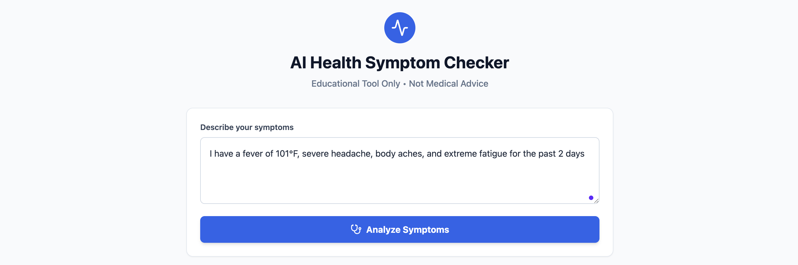
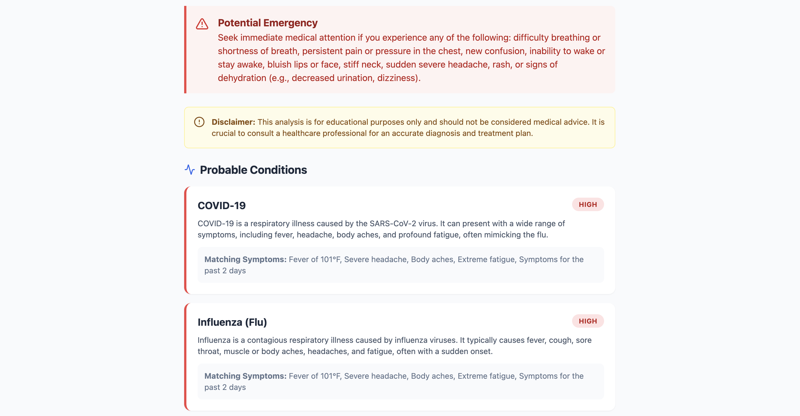
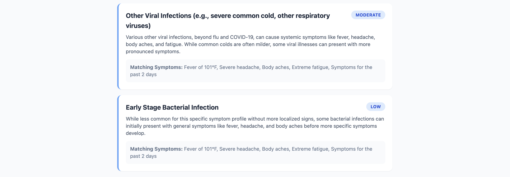
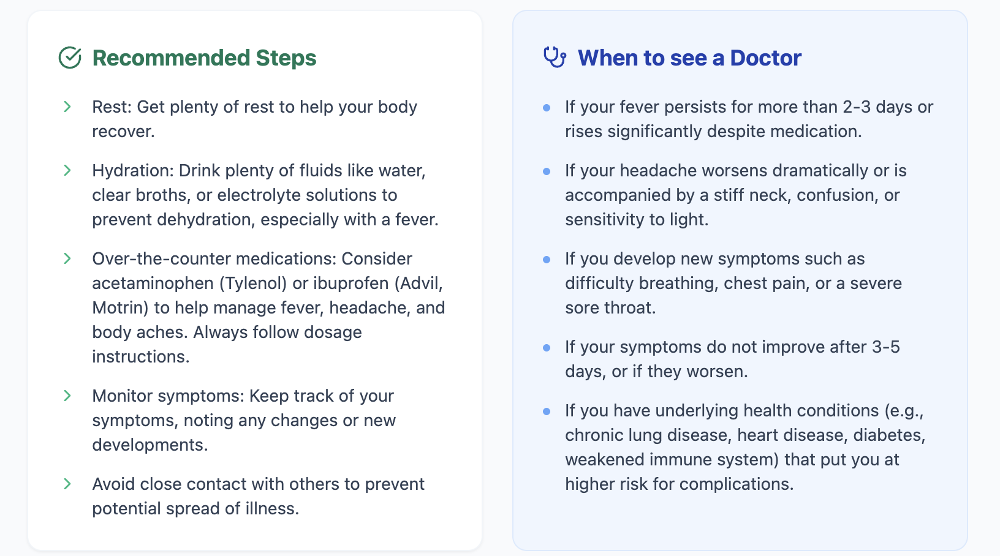
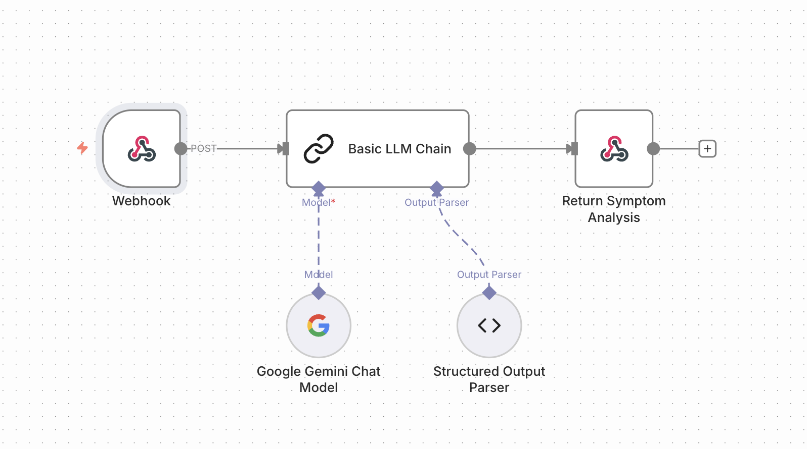

# 🏥 AI-Powered Health Symptom Checker

> **Disclaimer:**  
> This is an **educational prototype** that demonstrates the use of generative AI in health-related contexts.  
> It is **not** a medical device and must **not** be used for diagnosis, treatment, or emergency decision-making.

A full-stack application that uses **Google Gemini** via **n8n** to analyze user-submitted symptoms and return structured, easy-to-understand health insights.

The focus of this project is to demonstrate:

- How to use **n8n as a low-code backend** (workflow-as-API).
- How to build a modern **React + Vite + Tailwind** frontend that consumes an AI-powered JSON API.
- How to enforce **structured JSON output** from an LLM so that the UI is stable and predictable.
- How to integrate **safety disclaimers** and **non-diagnostic language** in AI health applications.

---

## 📚 Table of Contents

1. [Project Overview](#-project-overview)  
2. [Architecture](#-architecture)  
3. [Features](#-features)  
4. [Tech Stack](#-tech-stack)  
5. [Folder Structure](#-folder-structure)  
6. [Backend Setup (n8n)](#-backend-setup-n8n)  
7. [Frontend Setup (React + Vite)](#-frontend-setup-react--vite)  
8. [API Contract](#-api-contract)  
9. [Safety & Limitations](#-safety--limitations)  
10. [Potential Enhancements](#-potential-enhancements)  
11. [How This Demonstrates “Unthinkable” Skills](#-how-this-demonstrates-unthinkable-skills)  
12. [License](#-license)

---

## ✨ Project Overview

This project demonstrates a **modern low-code + code** architecture:

- The **backend API** is implemented as an **n8n workflow**, not as a traditional Express / Django app.
- The **frontend** is a standard React SPA (Single Page Application) built using **Vite** and **TailwindCSS**.
- The backend calls **Google Gemini (1.5 Flash)** to:
  - Parse the user’s symptom description,
  - Suggest **probable conditions** (non-diagnostic),
  - Provide **general recommendations** and **“when to see a doctor”** guidance,
  - Always include explicit **disclaimers**.

### 📸 Application Screenshots

**1. Inputting Symptoms**  


**2. AI-Generated Analysis**  




**3. n8n workflow** 

---

## 🏗 Architecture

High-level architecture:

```text
+---------------------------+        +-----------------------+
|     React Frontend        |        |         n8n           |
|---------------------------|        |-----------------------|
| - Symptom input form      |  HTTP  | - Webhook Node        |
| - Calls /symptom-check -->+------->+ - Basic LLM Chain     |
| - Renders JSON response   |  POST  | - Google Gemini Model |
| - Cards for conditions    |        | - Structured Parser   |
+---------------------------+        | - Respond to Webhook  |
                                     +-----------------------+
                                                |
                                                | Google AI Studio API
                                                v
                                       +-------------------+
                                       |  Gemini 2.5 Flash |
                                       +-------------------+
## 🧩 Full System Breakdown

### **Frontend**
- Collects symptoms entered by the user  
- Sends a **POST** request to the n8n webhook  
- Displays the AI-generated **structured JSON analysis** as a clean UI  

### **n8n Workflow**
- Acts as the **middleware** and **AI orchestrator**  
- Uses nodes to combine prompts, call Gemini, enforce structure, and return output  

### **Gemini (LLM)**
- Generates the **medical-education content**  
- Output is forced into a **strict JSON format** using n8n’s Structured Parser  

---

# 🌟 Features

### ✅ User can enter a free-text description of symptoms  
### ✅ Backend returns a strict JSON object containing:

- `disclaimer`  
- `emergencyWarning`  
- `symptomsAnalyzed[]`  
- `probableConditions[]`  
  - `conditionName`  
  - `description`  
  - `matchingSymptoms`  
  - `severity`  
  - `likelihood`  
- `recommendations[]`  
- `whenToSeeDoctor[]`

### ✅ Clean, responsive UI using **TailwindCSS**  
### ✅ Clear separation between **educational insights** and **real medical care**  
### ✅ n8n workflow is **importable** and can be visually edited  

---

# 🛠 Tech Stack

## 🖥 Frontend

| Technology | Description |
|-----------|-------------|
| **React** | Component-based UI library for building interactive user interfaces. |
| **Vite** | Fast bundler & dev server for modern frontend development. |
| **TailwindCSS** | Utility-first CSS framework for styling. |
| **Vanilla JS (fetch)** | Sends POST requests to the n8n backend. |

---

## ⚙ Backend (API via n8n)

| Technology | Description |
|-----------|-------------|
| **n8n** | Workflow automation platform acting as the backend. |
| **Webhook Node** | Exposes a POST endpoint `/symptom-check`. |
| **Basic LLM Chain** | Builds combined system + user input prompt. |
| **Google Gemini Chat Model Node** | Calls Gemini 1.5 Flash via Google AI Studio. |
| **Structured Output Parser** | Forces AI output into strict JSON schema. |
| **Respond to Webhook** | Returns the final JSON back to the frontend. |

---

## 🤖 AI Model

| Model | Description |
|-------|-------------|
| **Google Gemini 1.5 Flash** | Generates structured medical-educational insights. |

---

# 📂 Folder Structure

Example recommended structure:

```text
project-root/
├── frontend/
│   ├── index.html
│   ├── src/
│   │   ├── main.tsx / main.jsx
│   │   ├── App.tsx / App.jsx
│   │   └── components/
│   │       └── SymptomChecker.tsx
│   ├── public/
│   ├── package.json
│   ├── vite.config.ts
│   └── tailwind.config.cjs / tailwind.config.js
│
├── backend_using_n8n/
│   ├── n8n_workflow.json
│   ├── README.md
│   └── (any helper docs or exports)
│
├── assets/
│   ├── result1.png
│   ├── result3.png
│   └── n8n_workflow.png
│
└── README.md   <-- main documentation file
